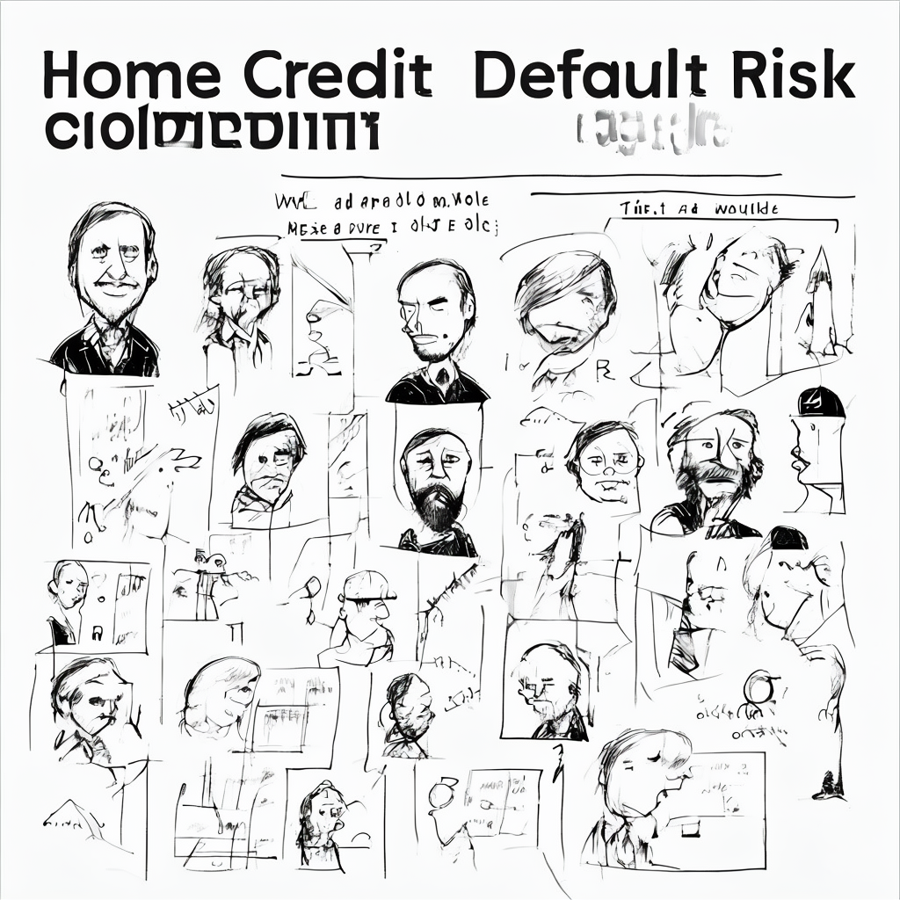

# Predicting Loan Repayment Capability: A Credit Risk Odyssey
---
**Author:** Martynas Loveikis
---
## Table of Contents

- [Introduction](#introduction)
- [Mission Objective](#mission-objective)
- [Action Plan](#action-plan)
- [Installation](#installation)
- [Usage](#usage)
- [Deployment](#deployment)
- [Data](#data)
- [Methodology](#methodology)
- [Results](#results)
- [Contributing](#contributing)
- [License](#license)

---
## introduction



This project: Predicting who will repay their loans and who won't. **Basically, we're financial detectives analyzing the credit behavior of loan applicants to uncover repayment potential.** Challenging, but rewarding.

---
## Mission Objective

The goal? **Predict who will repay their loans and who won't.** Sounds straightforward, but the data has other plans. Time to untangle the web of credit history, spending habits, and loan applications.

---
## Action Plan

Right, so the grand plan to predict loan repayment is:

*   **Data Retrieval and Cleaning:** Gather the data. Handle missing values. *Thrilling*.
*   **Exploratory Data Analysis:** Create charts like this one. Spot trends. *Exciting*.
*   **Feature Engineering:** Build new variables. Drop noisy ones. *Creative genius*.
*   **Predictive Modeling:** Train machine learning models. Predict defaults. *Fingers crossed*.
*   **Reporting and Recommendations:** Wrap it all up. Share insights. *The finale*.

---
## Project Showcase

Explore the project in interactive HTML format (best viewed in Brave Browser):

[Credit Risk Analysis Project](https://mlovei.github.io/html-pages/)

---

## Installation

To set up the project environment:

1. Clone the repository:
   `git clone https://github.com/MLovei/credit-risk`

2. Navigate to the project directory:
   `cd credit-risk`

3. Install Poetry if you don't have it already:
   `pip install poetry`

4. Install dependencies using Poetry:
   `poetry install`

5. Activate the Poetry virtual environment:
   `poetry shell`

Poetry will automatically create and manage the virtual environment for you based on the dependencies specified in the `pyproject.toml` file.
The `poetry.lock` file ensures that all team members use the same dependency versions.


## Usage

To run the project:

1. Open the notebook `credit_risk.ipynb` in your preferred IDE (e.g., Jupyter Notebook or VS Code).
2. Run all cells sequentially to preprocess data, train models, and generate predictions.
3. Submit predictions to Kaggle using the provided submission commands.

### Using the Deployed Model

The model is deployed as a REST API and can be accessed via HTTP requests. Here's an example of how to send a request using `curl`:
```
curl -X POST -H "Content-Type: application/json" -d '{
"EXT_SOURCE_3": 0.7,
"EXT_SOURCE_2": 0.5,
"EXT_SOURCE_1": 0.6,
"AMT_CREDIT": 100000,
"AGE_YEARS": 35,
"CODE_GENDER": "F",
"NAME_EDUCATION_TYPE": "Higher education"
}' https://tc3-4-gcp-test-27095879081.europe-central2.run.app/predict
```
This command sends a POST request with the provided JSON payload to the `/predict` endpoint of the deployed model. The response will be a JSON object containing the predicted probability of loan default.

---

## Deployment

The project is deployed and accessible via the following link:

[https://tc3-4-gcp-test-27095879081.europe-central2.run.app/](https://tc3-4-gcp-test-27095879081.europe-central2.run.app/)

___

## Data

The dataset is sourced from the Kaggle competition "Home Credit Default Risk."

---

## Methodology

1. **Data Cleaning and Preprocessing**
2. **Exploratory Data Analysis**
3. **Feature Engineering**
4. **Model Selection and Training**
5. **Hyperparameter Tuning**
6. **Ensemble Methods**

---

## Results

### Submission Results Overview

Here’s a snapshot of the submission results for the Home Credit Default Risk competition:


---

## Contributing

Contributions to this project are welcome. Please fork the repository and submit a pull request with your changes.

---

## License

This project is licensed under the MIT License